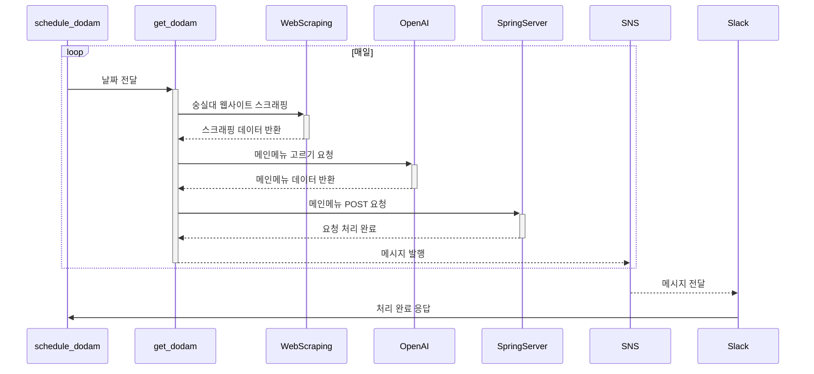

# Food Scrapper Serverless

Food Scrapper Serverless는 AWS Lambda를 이용하여 학교 식당 메뉴를 스크랩하고, Slack으로 알림을 보내주는 서버리스 애플리케이션입니다. 이 프로젝트는 Serverless Framework를 사용하여 AWS 서비스에 배포됩니다.

## 기능

- 학교 식당 웹사이트에서 일일 메뉴 정보 스크랩
- 스크랩된 메뉴 정보를 가공하여 Slack 채널에 메시지로 전송

## 기술 스택

- AWS Lambda: 메뉴 스크랩 및 가공 로직 실행
- AWS API Gateway: HTTP 요청에 대한 엔드포인트 제공
- AWS Step Functions: 스크랩과 알림 전송 프로세스 관리
- Serverless Framework: 인프라 관리 및 배포 자동화

## 환경 설정

### 필요 조건

- Node.js (버전 12 이상)
- Serverless Framework
- AWS 계정 및 CLI 구성

### Serverless Framework 세팅

1. Serverless Framework 설치:

```bash
npm install -g serverless
```

2. secrets.yml 파일 생성 (노션 참조)
3. serverless 의존성 폴더 생성
```bash
mkdir -p python-requirements-layer/python/lib/python3.9/site-packages
pip install -r requirements.txt -t python-requirements-layer/python/lib/python3.9/site-packages
```
4. serverless plugin 설치
```bash
serverless plugin install -n serverless-step-functions
```
5. serverless credential 등록 (노션 참조)


## Structure



