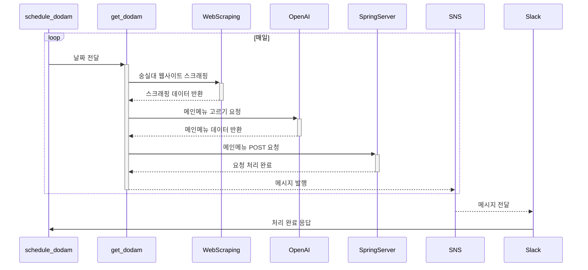

# Food Scrapper Serverless

Food Scrapper Serverless는 AWS Lambda를 이용하여 학교 식당 메뉴를 스크랩하고, Slack으로 알림을 보내주는 서버리스 애플리케이션입니다. 이 프로젝트는 Serverless Framework를 사용하여 AWS 서비스에 배포됩니다.

## 기능

- 학교 식당 웹사이트에서 일일 메뉴 정보 스크랩
- 스크랩된 메뉴 정보를 가공하여 Slack 채널에 메시지로 전송

## 기술 스택

- AWS Lambda: 메뉴 스크랩 및 가공 로직 실행
- AWS API Gateway: HTTP 요청에 대한 엔드포인트 제공
- AWS EventBridge: 스케줄링된 스크랩 작업 관리
- AWS SAM: 인프라 관리 및 배포 자동화

## 환경 설정

### 필요 조건

- Python 3.11
- AWS SAM CLI
- AWS 계정 및 CLI 구성

### AWS SAM 설정

1. AWS SAM CLI 설치:

**macOS (Homebrew):**
```bash
brew install aws-sam-cli
```

**Linux/Windows:** [AWS SAM CLI 설치 가이드](https://docs.aws.amazon.com/serverless-application-model/latest/developerguide/serverless-sam-cli-install.html) 참조

2. AWS CLI 설정:
```bash
aws configure
```

3. Python 의존성 레이어 생성:
```bash
mkdir -p python-requirements-layer/python/lib/python3.11/site-packages
pip install -r requirements.txt -t python-requirements-layer/python/lib/python3.11/site-packages
```

## 배포 방법

### 1. 환경 설정 파일 준비

`env.json` 파일 생성 (루트 디렉토리):
```json
{
  "Parameters": {
    "GPTApiKey": "your-openai-api-key",
    "SlackWebhookUrl": "your-slack-webhook-url", 
    "ApiBaseUrl": "your-production-api-url",
    "DevApiBaseUrl": "your-development-api-url"
  }
}
```

### 2. 배포 설정 파일

`samconfig.toml` 파일 생성 (루트 디렉토리):
```toml
version = 0.1
[default]
[default.deploy]
[default.deploy.parameters]
stack_name = "food-scrapper-default"
region = "ap-northeast-2"
confirm_changeset = true
capabilities = "CAPABILITY_IAM"
parameter_overrides = [
    "GPTApiKey=your-gpt-api-key",
    "SlackWebhookUrl=your-slack-webhook-url", 
    "ApiBaseUrl=your-api-base-url",
    "DevApiBaseUrl=your-dev-api-base-url"
]
```

> ⚠️ **보안 주의사항**: `samconfig.toml`에는 민감한 정보가 포함되므로 `.gitignore`에 추가하세요.

### 3. 빌드 및 배포

```bash
# 애플리케이션 빌드
sam build

# 템플릿 검증
sam validate

# 초회 배포 (가이드 모드)
sam deploy --guided

# 이후 배포
sam deploy
```

### 4. 로컬 개발 및 테스트

```bash
# 로컬 API 서버 실행
sam local start-api --env-vars env.json

# 특정 함수 로컬 실행
sam local invoke HaksikSchedulingFunction --event event.json --env-vars env.json

# 로그 확인
sam logs --stack-name food-scrapper-default --tail
```

### 5. 배포된 리소스 확인

배포 후 다음 엔드포인트들이 생성됩니다:

**스크래핑 API (백업용):**
- 도담식당: `https://{api-id}.execute-api.ap-northeast-2.amazonaws.com/Prod/scraping/dodam`
- 학생식당: `https://{api-id}.execute-api.ap-northeast-2.amazonaws.com/Prod/scraping/haksik`
- 교직원식당: `https://{api-id}.execute-api.ap-northeast-2.amazonaws.com/Prod/scraping/faculty`
- 기숙사식당: `https://{api-id}.execute-api.ap-northeast-2.amazonaws.com/Prod/scraping/dormitory`

**스케줄링 API (메인):**
- 도담식당: `https://{api-id}.execute-api.ap-northeast-2.amazonaws.com/Prod/schedule/dodam`
- 학생식당: `https://{api-id}.execute-api.ap-northeast-2.amazonaws.com/Prod/schedule/haksik`
- 교직원식당: `https://{api-id}.execute-api.ap-northeast-2.amazonaws.com/Prod/schedule/faculty`
- 기숙사식당: `https://{api-id}.execute-api.ap-northeast-2.amazonaws.com/Prod/schedule/dormitory`

### 자동 스케줄

- **도담/학생/교직원식당**: 매주 일요일 오후 4시 (KST) 자동 실행
- **기숙사식당**: 매주 월요일 오전 8시 (KST) 자동 실행


## Structure



